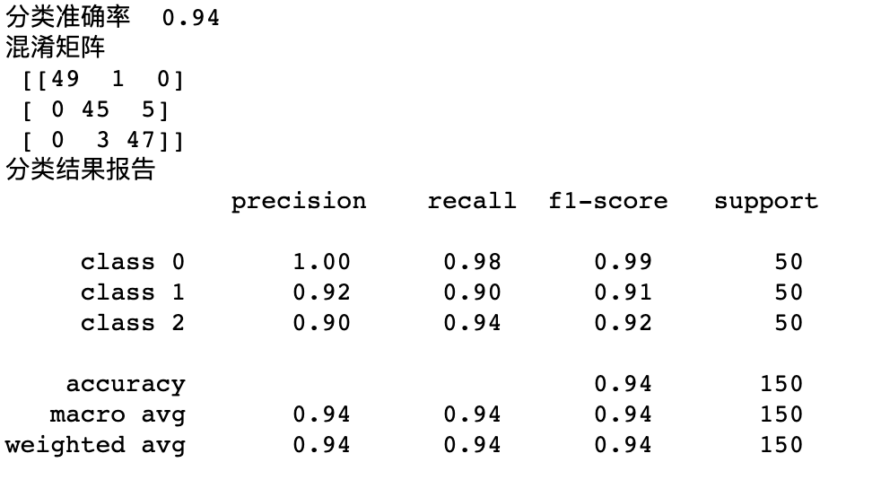
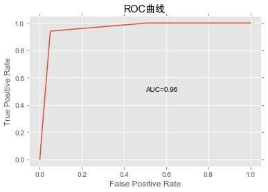
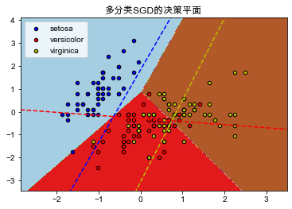

### 用Python实现逻辑回归模型
1. 实现随机梯度下降
2. 数据集
    - Sklearn内置鸢尾花数据集
    - 共150条数据，3个类别，其中有一种和其他两种线性可分
    - 鸢尾花总共有4维特征
    - 评测模型的AUC（全部当训集，在训练集上评测即可）
    - 根据你的结果判断哪一类和其他两类线性可分
  
#### 1.  导入第三方包

```python
    
    from sklearn.linear_model import SGDClassifier
    import numpy as np
    from sklearn import metrics
    import matplotlib.pyplot as plt
```

#### 1.  下载鸢尾花数据集

```python
    from sklearn.datasets import load_iris
    iris = load_iris()
```

- 在下面建立两个array数姐：一个数组X（其size为[n_samples, n_features]）：保存着训练样本，对数据进行归一化；一个数组Y：保存着训练样本的target值（class label）

```python
    X = iris.data
    Y = iris.target
    mean = X.mean(axis=0)
    std = X.std(axis=0)
    X = (X - mean) / std
    h = .02
```


#### 2.  随机梯度下降

- 建立学习率$\alpha$为0.001，最大迭代次数为100次，默认L2正则化的随机梯度下降分类器clf，通过SGD建模预测的标签Y_hat

```python
    clf = SGDClassifier(alpha=0.001, max_iter=100).fit(X,Y)
    Y_hat = clf.predict(X)
```
- 通过metrics获取分类准确率、混淆矩阵、分类结果报告内容
  
```python
    accuracy = metrics.accuracy_score(Y, Y_hat)
    confusionmatrix = metrics.confusion_matrix(Y, Y_hat)
    target_names = ['class 0', 'class 1', 'class 2']
    classifyreport = metrics.classification_report(Y, Y_hat,target_names=target_names)
    print('分类准确率 ',accuracy)
    print('混淆矩阵 \n', confusionmatrix)
    print('分类结果报告 \n', classifyreport)
```

- 得到准确率、精度、召回率、F1分数等评测指标如下图所示


- 利用metrics中的roc_curve计算FPR和TPR，从而绘制ROC曲线（红色实线），得到AUC为0.96，




#### 3.  判断线性可分类

- 为了更好的进行二维可视化，选择前2个特征进行研究并绘制网格
  
```python
    X = iris.data[:, :2]
    Y = iris.target
    x_min, x_max = X[:, 0].min() - 1, X[:, 0].max() + 1
y_min, y_max = X[:, 1].min() - 1, X[:, 1].max() + 1
xx, yy = np.meshgrid(np.arange(x_min, x_max, h),
                     np.arange(y_min, y_max, h))
    # 绘制决策边界，对每个点赋予相应的决策颜色进行区分
    Z = clf.predict(np.c_[xx.ravel(), yy.ravel()])
    # 将数据可视化
    Z = Z.reshape(xx.shape)


    cs = plt.contourf(xx, yy, Z, cmap=plt.cm.Paired)
    plt.axis('tight')
    colors = "bry"
    # 绘制出所有的训练样本（这里把所有的样本当作训练样本来使用）
    for i, color in zip(clf.classes_, colors):
        idx = np.where(Y == i)
        plt.scatter(X[idx, 0], X[idx, 1], c=color, label=iris.target_names[i],
                    cmap=plt.cm.Paired, edgecolor='black', s=20)
    plt.title("多分类SGD的决策平面")
    plt.axis('tight')


    # 将其中一类作为标准类，合并其余2类作为对比类，形成二分类模型进行比较
    xmin, xmax = plt.xlim()
    ymin, ymax = plt.ylim()
    coef = clf.coef_
    intercept = clf.intercept_


    def plot_hyperplane(c, color):
        def line(x0):
            return (-(x0 * coef[c, 0]) - intercept[c]) / coef[c, 1]

        plt.plot([xmin, xmax], [line(xmin), line(xmax)],
                ls="--", color=color)


    for i, color in zip(clf.classes_, colors):
        plot_hyperplane(i, color)
    plt.legend()
    plt.show()
```


- 从下图可以看到，setosa类鸢尾花（蓝色远点）和其他两类鸢尾花（红色圆点和黄色圆点）是可以线性可分的。